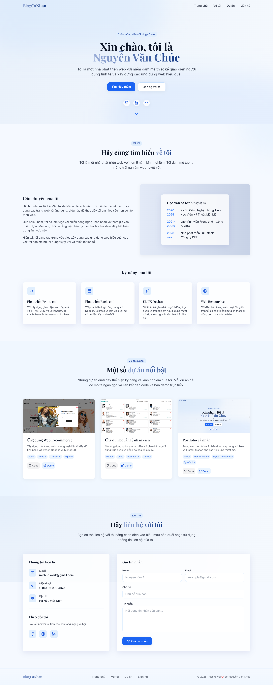

# Azure White Bio

## Thông tin dự án

## Công nghệ sử dụng

Dự án này sử dụng các công nghệ sau:

- **React**: Thư viện JavaScript để xây dựng giao diện người dùng.
- **Vite**: Công cụ xây dựng và máy chủ phát triển nhanh.
- **TypeScript**: Một phần mở rộng của JavaScript với kiểu tĩnh.
- **Tailwind CSS**: Một framework CSS ưu tiên tiện ích cho phát triển giao diện người dùng nhanh chóng.
- **Lucide React**: Bộ sưu tập các biểu tượng SVG đơn giản và tùy chỉnh.
- **React Hook Form**: Thư viện quản lý trạng thái và xác thực biểu mẫu.
- **Radix UI**: Bộ các thành phần UI có thể truy cập và tùy chỉnh.
- **React Query**: Thư viện để lấy, lưu vào bộ nhớ đệm và cập nhật dữ liệu không đồng bộ trong React.
- **Zod**: Thư viện khai báo và xác thực schema ưu tiên TypeScript.
- **ESLint**: Công cụ xác định và sửa lỗi trong mã JavaScript.
- **Prettier**: Công cụ định dạng mã theo ý kiến.

## Mô tả dự án

Azure White Bio là một trang web portfolio cá nhân giới thiệu các dự án và kỹ năng khác nhau. Trang web bao gồm các phần như:

- **Trang chủ**: Phần chào đón với giới thiệu ngắn gọn.
- **Giới thiệu**: Thông tin về nhà phát triển.
- **Dự án**: Trưng bày các dự án nổi bật với mô tả, thẻ và liên kết đến kho GitHub và bản demo trực tiếp.
- **Liên hệ**: Biểu mẫu liên hệ để khách truy cập liên lạc.

## Demo

Bạn có thể xem bản demo trực tiếp của dự án [tại đây](https://chucnguyen2k2.github.io/azure-white-bio-main).

## Hình ảnh

